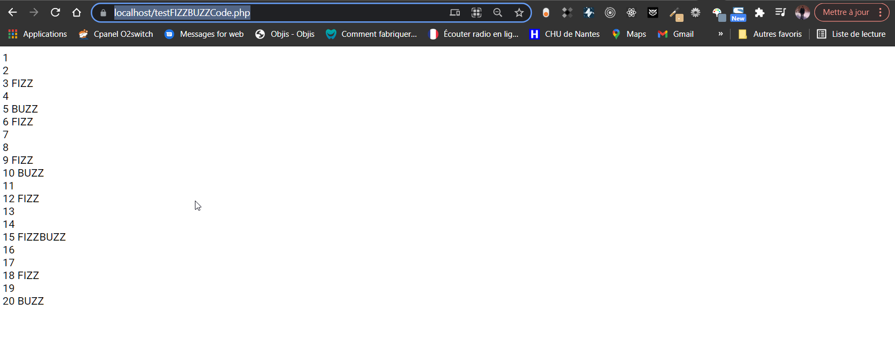

# EXERCICE FIZZBUZZ

il s'agit d'afficher les nombres divsiibles par 3 et par 5 en affichant FIZZ et BUZZ respectivement sur les 20 premiers nombres

```PHP
<?php
    $message ="";

    //boucle sur les 20 premiers nombre
    for($i=1;$i<=20;$i++){
        // echo $i."\n";
        if (($i % 3)==0 || ($i % 5)==0){
            // Divisible par 3
            if (($i % 3)==0){
                //  print_r($i)." \n";
                // echo " nombre divisible par 3"."\n";
                $message ="FIZZ";
            }
              // Divisible par 5
              if(($i % 5)==0){
                // print_r($i)." \n";
                // echo " nombre divisible par 5"."\n";
                $message =$message."BUZZ";
                
            }
          //condition else peut etre supprimé  juste en cas de test d'indivisibilité 3 et 5
        }else{
            // echo  ($i)." indivisible"."\n";
        }
        
        // affichage des resultats finaux
        echo nl2br($i." ".$message."\n");
        $message ="";
    }
    ?>
```
## Resultat obtenu
