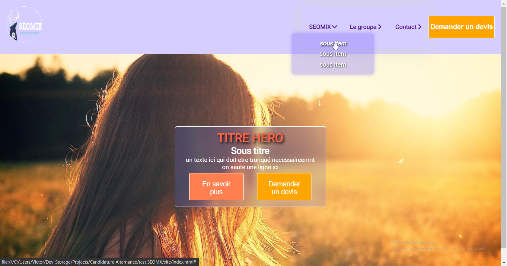

# EXERCICE CREATION SITE INTERNET

il s'agit de creer une page d'un site web comportant une navbarre ainsi q'une section Hero comme le montre le resultat ( les images sont aleatoires issues de l'api picsum)

- Accès à la[ demo live](https://seomix-dgwebcreation.netlify.app/)
## Resultat obtenu
